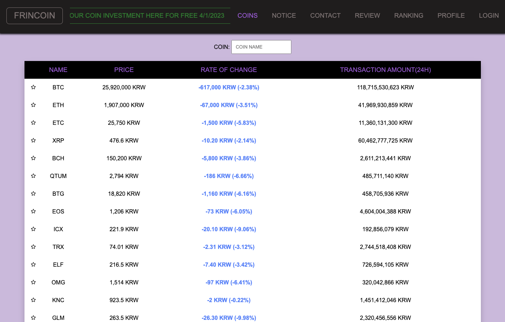

  <h1>FRINCOIN 제작중 - on progress</h1>
  <h3>비트코인 거래 완벽 이해, 당신의 투자기술 활용해보세요. 여기는 프린코인!</h3>
  
"Experience the future of digital currency with our easy-to-use <strong>Bitcoin testing website</strong>, the ultimate tool for mastering the intricacies of Bitcoin transactions for free"

  <h2>현재 상태 - Current Status</h2>
  
제작중입니다 4/1/2022 ~

  <h2>사용한 기술 - What I used</h2>  
    
    
    
    
    
    
    
    
    
    

  <h2>해야 할 목록 - To-Do-List</h2>  

- [ ] 기본 UI - Basic UI 

- 헤더/푸터 - Header&Footer (헤더는 완성 / 푸터 아직 : Header Completed / Footer Not Yet)
- 반응형 디자인 - Responsive Design 
- 

- [ ]  로그인 구현 - Login Auth

- 기초로직 (Basic Logic is completed as if Form submit etc) / 완성
- Google OAuth + 회원가입 페이지 / Google OAuth and registration page
- JWT 토큰 주고 받는 것으로 확실하게 로그인 된 유저에게만 구매/판매등 권한 부여 (With usin jwt token to give users the authentication to purchase/sell etc)
- 로그관리 - Managing LOG

- [ ] 코인차트 구현 - Implement Data Coin Chart(feat. chart.js)

- 실시간 코인 데이터 / Real-Time Coin Data / 완성 -> 차후에 socket 을 통해 많은 유저들의 유입에 대한 대책으로 생각해봐야함.
- 코인 테이블 클릭시, 차트 modal / Click the table row of the coin info to show the Chart modal / 완성 
- 5분전/1일전/30일전/1년전 차트데이터 구현 - Importing Chart Data of 5mins/1day/1month/1year ago data to show on the chart
- (로그인 구현 후 - After Login is implemented): 관심 코인 등록 - Register favourite coin 
- (로그인 구현 후 - After Login is implemented): 구매/판매 - Purchase & Sell
- (기본 프로토타입 구현 후 - After Basic Prototype is ready): 지정값 구매/판매 - Pre-registered price to purchase & sell

- [ ] 리뷰 게시판 구현 - Coin Review Forum

- 기본 게시판 CRUD - Basic Forum with CRUD functionalities
- 작성자 계급/수익율/보유자산(원화) 표시 - Indicate writer's Rank/Rate of Return/Amount of coin(KRW)
- 댓글 - Comment
- 작성 페이지 - Page to Post 
- 삭제 버튼 - Button to delete
- 수정 버튼 - Button to modify 

- [X] 404 게시판 구현 - 404 Page

- [ ] 공지 게시판 구현 - Notice Forum

- 기본 게시판 CRUD - Basic Forum with CRUD functionalities
- 작성자 계급/수익율/보유자산(원화) 표시 - Indicate writer's Rank/Rate of Return/Amount of coin(KRW)
- 작성 페이지 - Page to Post 
- 삭제 버튼 - Button to delete
- 수정 버튼 - Button to modify 
- 웹사이트 사용방법 포스트 등록 - Post how to use this website

* 관리자만 가능하도록 - Only for admin *

- [ ] 랭킹 페이지 구현 - Coin Ranking Page

- 랭크 아이콘들 찾기 - Find Rank Icons
- 1~50위 페이지 - 1st~50th Page
- 보유자산과 수익율을 통한 랭크 계산 - Simple algorithm to calculate the rank based on 'return rate' & 'Amount of coin(KRW)'

- [ ] 출석 페이지 구현 - Attendance Page

- 기본 출석 체크 요청 구현 - Basic attendance check request / 완성
- 출석 시, 가상 돈 지급 - When you attend, you will get the money that is available to purchase coin in this website
- 연속 출석 시, 추가 돈 지급(10일단위 or 일주일) - If you attend continuously, you will get bonus (Every 10days or 7days)
- 출석 달력 UI (리액트 캘린더) - Attendance Calendar UI (React-Calendar) / 완성
- 연속 출석 일수 표시 p 태그 - Show continuous attendance on p tag 

- [ ] 프로필 페이지 구현 - Profile Page

- 유저 본인정보 확인 - User's personal information
- 유저 웹사이트 내 자산 및 보유 코인 확인 - User's amount of coins etc in website
- 로그아웃 - Log out

- [ ] 연락 페이지 - Contact Page

